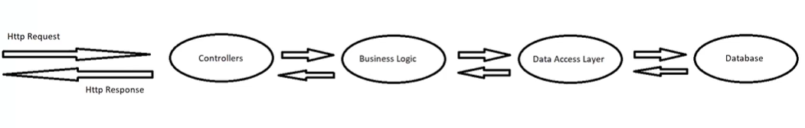
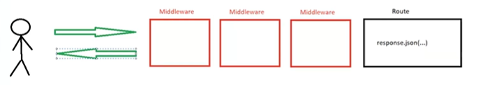

# RESTful Services Practice and Theory
 RESTful Services Practice and Theory

 # What is Web Service?

 - a system that resides on a Web Server for only purpose: serving data needed by client.
 - web services can perform calculations, provide the client with certain utilities and data.
 - there are many trqchiques, architectures and technologies that allow us to create Web Services, such as: XML Web Services, Remote Procedure Calls (RPCs), Windows Communication Foundation (WCF), REST APIs, etc...

# Understanding HTTP Protocol

- Hypertext Transfer Protocol.
- is internet protocol for requesting and receiving web pages.
- the communication itself what works on the background is called TCP (Transmission Control Protocol). HTTP is basically sending-receiving documents on the internet.
- it is the browser that creates HTTP requests and sends them to the Server.

What exactly is HTTP Request and what is its format? It is a document that consists of five parts: 
1. Method (type of action: just GET and POST)
2. Page (the URL address of a page/path)
3. HTTP Version
4. HTTP Headers (follow-up data of a request: host, authorization, user-agent)
5. HTTP Request Body (main data of a request)

What is HTTP Response and its format?
1. HTTP Version 
2. HTTP Status Code (special code for an event - success(200, 201), failure(401, 404), etc.)
3. HTTP Status Text (text explaining the status code)
4. HTTP Response Headers (follow-up data of a response: name of a server, date, content-type)
5. HTTP Response Body (main data of a response: usually an html-document)

# HTTP Status Codes:
- 1xx Informational Status
- 2xx Success Status
- 3xx Redirection Status
- 4xx Client Error
- 5xx Server Error

# REST Architecture
- Representational State Transfer.
- Popular software architecure for creating Web Services.
- Transfers tables or collections (called resources) through URLs.
- Uses HTTP protocol for sending and receiving data.
- Does not deal with implementation, only design guidelines (meaning you can build in with any backeng language if you follow the rules)
- Developed by Roy Fielding in 2000
- ANy Web Service implemented by REST guidelines is called RESTful Service or REST API

REST and HTTP: REST is build on top of HTTP protocol. The data sent and received is placed inside the HTTP documents. The difference is: in case of REST Request/REST Response the data will be presented in .json format, and not as an html document.

REST APIs have more common methods than HTTP: apart from GET and POST, there are also PUT (update), PATCH (update partially), DELETE.

# Ways to build a Web Server

There are several ways for building your own Server: starting with basic built-in Node.js module called "http", up to more popular libraries like Express. To install the latter one simply run - npm i express - in the terminal (plus npm i @types/express in case of TypeScript). If TS wont see express import as a default, add the following configuraion in your tsconfig.json file:

            "esModuleInterop": true"

The default method will always be GET. When you want to check other methods the best way is to download Postman and try the URL's there.

# Multi-layered concept

So usually when building a Server you would want to follow a certain logic (or scheme). One of the most popular ones is the so-called "multi-layered" scheme, consisting of six layers connecting frontend with database:

1. Controllers - JS/TS files settling the connection between requests, routes and data-providing functions. 
2. Business Logic - layer that deals with all the operations on data.
3. Data Access Layer (DAL) - the layer that has direct access to the database.
4. Database - outer layer that stores the data.

# Small note on Environmental Variables

Environmental variables are a set of global dynamic values that provide a flexible way to configure and manage various system settings, such as ports, API keys, paths to executable files, the location of system libraries, or configuration parameters for an application, etc.

Environmental variables are typically stored in a ROOT file called .env . However, in order to use env variables, you should follow these steps: 

- install npm i dotenv.
- import it at the top of the main server file (as dotenv)
- call dotenv.config() function.
- use the env variables by typing process.env.NAME (where name is the key of an env variable).

In summary, .env files are typically used to store sensitive information that should not be exposed publicly, while config.json files are used to store application configuration data that may be shared across multiple environments.

# Small note on Query Strings

A query string is a part of a URL that contains data that the client (usually a web browser) sends to the server. It's a string of key-value pairs separated by an ampersand (&) and appended to the end of a URL after a question mark (?).

    http://localhost:3001/api/books/cheaper-than/15 - regular URL

    http://localhost:3001/api/books/cheaper-than?price=7&color=blue/ - query string

Query strings are useful when you have several parameters to send in the request. When you want to acces the data passed in a query string, simply use request.query.key-name.

# Middleware and Routes

Middleware are functions executed automatically between client requests and server responses. They are always placed inside the routes. Basically all the middleware are invoked twice - upon request and upon response. Each middleware has next() function that allows switching to the next middleware or any other function in the line.

It is important where you use middleware. If you put it right after initializing the server on the app-level (const server = express()) then all the route-controllers after will go through the middleware:

    const server = express(); 
    server.use(middleware-name);

In case you want a middleware only on one specific route-controller, you should define it after initializing the route: 

    const router = express.Router();
    router.use(middleware-name);

For even more specific cases of middleware usage - only per certain routes - you can call them right inside the routes: 

    router.get("/api/books", [middleware-name], async (request: Request, response: Response) => {
        const books = await logic.getAllBooksAsync();
        response.json(books); in json format
    });

# Pre-route and Post-route Middleware

Pre-route is ones that are defined before the routes, but where do we write the post-ones? In the next() function. NextFunction-s can be used inside the routes, right after request and response agruments.

So here instead of getting a response inside a route, we transfer the result to the next middleware and to the final middleware that will return the response. It is not such a good practice, as it can increase the complexity of the code and make it harder to maintain. It is generally better to handle all necessary tasks within the main request handler and only use post-middleware when it is necessary.

# Blocking and Non-blocking Middleware

Blocking middleware is a type of middleware that stops the execution of subsequent middleware and the request-response cycle until the current middleware has completed its task. This means that the server will not respond to any other requests until the current middleware has finished processing. Examples: IP-addresses from "the black list", other countries, "under construction" parts of sites, etc.

Non-blocking middleware, on the other hand, allows the request-response cycle to continue to execute while the middleware is processing. It does not stop the execution of subsequent middleware or the request-response cycle. Instead, it can pass control to the next middleware in the stack while it is still processing the current request. This approach is also known as "next() middleware" since the middleware function calls the next middleware in the stack before completing its task. Classic example: logger, error-logger.